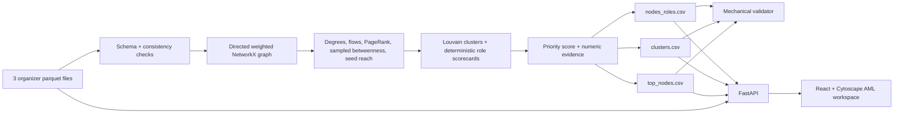

# Money Graph — explainable AML network triage

Money Graph turns the organizer's outgoing four-hop transaction crawl into an explainable investigation queue for a bank AML analyst. It answers: **which of these 2,248 GIDs should an analyst inspect first, and why?**

The system does not label a client guilty. A role, score, or cluster is a structural hypothesis inside the supplied graph and a prompt for deeper review.

## What is delivered

- A deterministic parquet-to-CSV pipeline that completes locally in about **1 second** on the supplied data.
- All required artifacts in [`outputs/`](outputs/): `nodes_roles.csv`, `clusters.csv`, and `top_nodes.csv`.
- A mechanical output validator.
- A read-only FastAPI investigation API.
- A browser workspace with exact GID search, a directed depth 0→4 map, a ranked queue, node/edge evidence, cluster filtering, and explicit data-coverage warnings.

Observed source data: **2,248 nodes · 3,119 directed flows · 4,840 transactions · 365,890,012.01 KZT**, 2026-07-01 through 2026-07-31.

## Architecture



The required outputs are fully offline and do not use an LLM, GPU, database, or internet service. `OpenAIKEY` is reserved for a future optional grounded assistant and is not read by the current application.

## Clean setup and run

Prerequisites used for the verified build:

- Python 3.13
- [uv](https://docs.astral.sh/uv/) 0.12+
- Node.js 24 and npm 11 (Node.js 20+ should also work)

From the repository root:

```powershell
uv sync --project backend --dev
npm ci --prefix frontend
```

Generate and validate all three required CSV files with one command:

```powershell
uv run --project backend pipeline
```

Expected terminal result includes:

```text
Loaded 2248 nodes, 3119 edges, 4840 transactions
SUBMISSION VALIDATION PASSED
Pipeline completed in <5 minutes -> .../outputs
```

Start the demo in two terminals:

```powershell
# terminal 1
uv run --project backend backend

# terminal 2
npm run dev --prefix frontend
```

Open [http://127.0.0.1:5173](http://127.0.0.1:5173). Vite proxies `/api` to `http://127.0.0.1:8000`.

Environment setup is optional. If a future assistant is enabled, copy `.env.example` to `.env` and set `OpenAIKEY`; the deterministic pipeline, API, and UI do not require it.

## Verification commands

```powershell
uv run --project backend validate-outputs
uv run --project backend pytest -q
uv run --project backend ruff check backend/src tests
npm run lint --prefix frontend
npm run build --prefix frontend
```

Latest observed results:

- Pipeline: **0.90 s**, validation passed.
- Tests: **2 passed** (only upstream TestClient deprecation warnings).
- Ruff and ESLint: passed.
- Vite production build: passed.
- Browser: overview, arbitrary GID search, depth-4 warning, edge details, and cluster filter verified at 1440×900 with no horizontal overflow or new console errors.

## Output contracts

### `outputs/nodes_roles.csv`

Exactly 2,248 unique source GIDs. Required columns are `gid`, `role`, `role_score`, `cluster_id`, `priority_score`, and `evidence`. Diagnostic columns expose the metrics that produced the result: degrees, observed amounts and transaction counts, PageRank, betweenness, seed reach, pass-through ratio, depth, seed status, and truncation status.

### `outputs/clusters.csv`

One row per Louvain community, including isolated nodes: `cluster_id`, `n_nodes`, `n_seed`, `sum_kzt_internal`, `top_gids`, and a deterministic, cautious `hypothesis`.

### `outputs/top_nodes.csv`

The top 50 nodes sorted by `priority_score` descending: `rank`, `gid`, `role`, `priority_score`, and a numeric `why`.

## Deterministic analytics

All percentile features rank positive observed values from 0 to 1; a zero remains zero. The graph is directed for role/flow metrics. Louvain intentionally uses the undirected weighted projection because communities answer “which nodes are densely connected,” not “which direction did money move”; direction remains preserved everywhere else. Louvain and sampled betweenness use seed `42`.

Betweenness samples 300 source nodes. This is deterministic, completes quickly on a normal laptop, and is documented rather than presented as an exact centrality value.

### Role rules

Each specialist score is clipped to `[0,1]`. Ineligible roles score zero. The highest eligible score is primary; ties follow the stable order shown below. If every specialist score is below **0.48**, the node is `peripheral` with confidence `1 - max_specialist_score`. `coordinator` additionally requires its own score to be at least **0.55**, preventing it from absorbing ordinary flow roles.

| Role | Eligibility | Scorecard | Interpretation and caveat |
|---|---|---|---|
| `consolidator` | `in_deg >= 2` | 35% incoming-degree percentile + 30% seed-reach percentile + 20% incoming-KZT percentile + 15% PageRank percentile | Observed funds converge from multiple sources. This is not proof of ownership or control. |
| `distributor` | `out_deg >= 3` | 40% outgoing-degree percentile + 25% outgoing-KZT percentile + 20% outgoing-tx percentile + 15% betweenness percentile | Observed funds fan out to several recipients. |
| `transit` | non-seed with both incoming and outgoing flows | 25% minimum in/out-degree percentile + 30% closeness of pass-through to 1 + 20% amount balance + 15% tx-count balance + 10% betweenness percentile | Observed inflow and outflow are similar. Seed nodes are excluded because their incoming side is incomplete. |
| `terminal` | `in_deg > 0`, `out_deg == 0`, and **`depth < 4`** | 35% incoming-KZT percentile + 30% incoming-degree percentile + 20% incoming-tx percentile + 15% seed-reach percentile | Candidate observed sink only within the supplied graph. A depth-4 no-outgoing node is never eligible. |
| `coordinator` | total degree ≥3 and score ≥0.55 | 30% betweenness percentile + 25% PageRank percentile + 20% seed-reach percentile + 15% total-degree percentile + 10% turnover percentile | Structurally important coordination candidate, not an attribution of criminal leadership. |
| `peripheral` | all specialist scores <0.48 | `1 - max_specialist_score` | No strong specialist pattern in the observed graph. A high confidence means the absence of a strong specialist signal is clear. |

`role_score` expresses how strongly the selected structural role is observed. It is not the probability that a client committed an offense.

### Priority score

Priority is separate from role confidence and estimates **analytical value of review inside the observed network**:

```text
structural_importance = 0.40*PageRank_pct + 0.40*betweenness_pct + 0.20*degree_pct

priority = 0.25*structural_importance
         + 0.25*max_specialist_role_score
         + 0.20*seed_reach_pct
         + 0.15*observed_turnover_pct
         + 0.15*betweenness_pct
```

Every top-list explanation includes concrete role confidence, seed reach, degree, observed turnover, and betweenness.

### Clusters

`networkx.community.louvain_communities` runs on the weighted undirected projection. Communities are deterministically ordered by size then smallest GID; every isolate receives a cluster. Cluster hypotheses are templates based on seed count, internal turnover, specialist roles, and bridge presence. They never invent people, organizations, or activity outside the dataset.

## API used by the demo

| Endpoint | Purpose |
|---|---|
| `GET /api/summary` | Dataset totals and role counts |
| `GET /api/top-nodes` | Ranked analyst queue |
| `GET /api/nodes/{gid}` | Role, scores, metrics, evidence, and coverage warning |
| `GET /api/nodes/{gid}/neighbors` | Incoming and outgoing relationships |
| `GET /api/edges/{src}/{dst}` | Aggregate flow and dated individual transactions |
| `GET /api/clusters` / `{cluster_id}` | Cluster summaries and top nodes |
| `GET /api/graph?gid=...&cluster_id=...` | Full, ego, or cluster graph payload |

GIDs are transported to the browser as strings. They are int64 values larger than JavaScript's safe-integer range; converting them to `Number` would corrupt identity.

## Data limitations and algorithm impact

| Limitation | What the system does about it |
|---|---|
| Outgoing-only four-hop crawl | Describes every amount as “observed”; never claims a complete balance or customer history. |
| Depth-4 truncation | Marks `truncated_by_depth`; a depth-4 node with no visible outgoing edge is never eligible for `terminal`; the UI shows a prominent warning. |
| Seed incoming is incomplete | Excludes seed nodes from the pass-through/transit rule and appends a seed caveat to evidence. |
| Partial graph balance | Uses `in_kzt`/`out_kzt` only within this graph; does not call their difference income, spend, or balance. |
| Transfers below 5,000 KZT absent | Makes no claim that small transfers or structuring are absent. |
| Intrabank transfers only | Makes no claim about flows at other banks, cash, crypto, or external rails. |
| July 2026 only | Scores describe this one-month snapshot, not stable long-term behavior. |
| No PII or customer profile | Uses synthetic GID as the only identity key; creates no fake names, ages, income, or organizations. |
| No role ground truth | Uses explainable scorecards and exposes metrics; does not report accuracy or treat roles as labels of fact. |
| Heuristic scores | Treats role and priority as review hypotheses, never guilt probabilities. |

## Five-minute demo path

1. Run `uv run --project backend pipeline` and point out the validator pass and sub-second runtime.
2. Open the workspace: the first view explains the 81-seed, four-hop shape through horizontal depth bands.
3. Select top priority **GID `100000003684369100`**: distributor score 0.988, priority 0.980, 24 incoming and 62 outgoing counterparties, 3.85M observed incoming and 8.59M KZT observed outgoing, reached by 10 seeds. Open its 1.58M KZT incoming edge from `100000008748914100`.
4. Search **GID `100000003115284100`**: consolidator score 0.990, priority 0.934, 8 incoming counterparties, 11 reachable seeds, 2.16M KZT observed incoming. Open the 622K KZT edge from `100000000343175100`.
5. Search depth-boundary example **GID `100000000404740100`**: depth 4, one 25K incoming flow and no visible outgoing flow. The UI explicitly says the crawl ended and does **not** call it terminal.
6. Filter cluster 1 and show its node/seed count, observed internal turnover, and cautious hypothesis.
7. Ask for any arbitrary GID and repeat search → ego map → node evidence → relationship → dated transactions.

## Scaling to about one million nodes

The product contract and scorecards remain, but the implementation would change:

- Scan parquet with Polars/DuckDB or an analytical warehouse rather than loading all rows into pandas.
- Use graph-tool, igraph, or a distributed graph engine for centrality and community detection.
- Replace the 300-node approximation with validated sampling or batch/distributed approximations.
- Materialize node/edge aggregates and clusters; paginate API responses and request only server-side ego/cluster tiles.
- Render level-of-detail supernodes in the browser instead of sending the full graph.

No database or distributed layer is added here because 2,248 nodes fit comfortably in memory and the required pipeline already completes well below five minutes.

## Privacy and security

- `.env`, virtual environments, caches, build output, archives, and `node_modules` are ignored.
- Core analytics never sends the organizer dataset outside the machine.
- The API is read-only and exposes only the supplied synthetic GIDs and graph-derived metrics.
- `OpenAIKEY` is optional, stays in `.env`, and is not used by the submitted core.

## Repository map

```text
backend/src/backend/pipeline.py          deterministic analytics + CSV export
backend/src/backend/validate_outputs.py  submission contract checks
backend/src/backend/api.py               read-only demo API
frontend/src/App.tsx                     investigation workspace
outputs/                                 required generated artifacts
tests/                                   pipeline and API contract checks
data_for_case/                           organizer brief, starter, README, parquet
```
