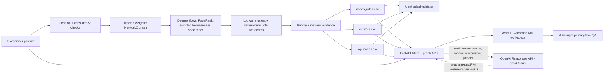
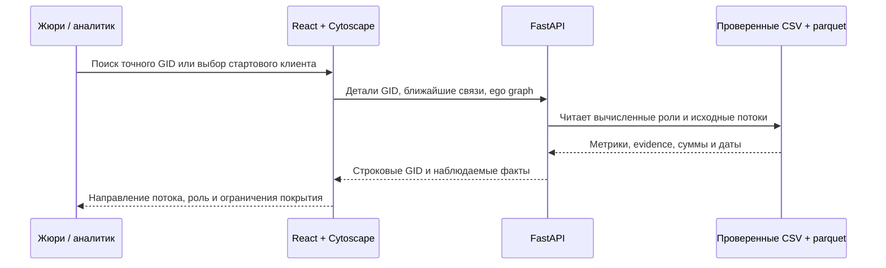
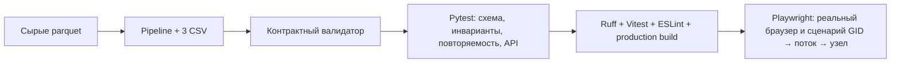

# Граф денег — объяснимая проверка AML-сети

«Граф денег» превращает выгрузку исходящих переводов на четыре колена в объяснимую очередь проверки для банковского AML-аналитика. **Стартовые клиенты (seed)** — 81 GID, ранее выявленный в материалах кейса. Они служат началом обхода графа; связь с ними сама по себе не доказывает причастность других клиентов. Главный вопрос продукта: **кого из 2 248 GID смотреть первым и почему?**

Система не называет клиента виновным. Роль, score, кластер и аналитический сигнал — это структурная гипотеза внутри предоставленного графа и основание для углублённой проверки.

## Что реализовано

- Детерминированный parquet-to-CSV pipeline, выполняющийся примерно за **1 секунду**.
- Все обязательные артефакты: [`nodes_roles.csv`](outputs/nodes_roles.csv), [`clusters.csv`](outputs/clusters.csv), [`top_nodes.csv`](outputs/top_nodes.csv).
- Механический validator и расширенные семантические invariants.
- FastAPI для поиска, фильтрации, расследования GID/рёбер, агрегированного графа кластеров и опционального AI-помощника.
- Русскоязычное рабочее место: точный поиск GID, фильтры, топ-50 и отдельная очередь **81 стартового клиента**, направленный граф 0→4, переходы узел→поток→контрагент, объяснение ролей, кластерный граф и сводная аналитика.
- Прямые связи со стартовыми клиентами выделены красным в графе и списках; выбранный поток показывает направление стрелкой. Топы кластеров показывают долю наблюдаемых транзакций с отправителем из стартового списка.
- Опциональные AI-сводка до 200 символов и чат с фактами выбранных GID; детерминированное правило не позволяет назвать обрезанный узел 4-го колена конечным получателем.
- Vitest-проверки отображения/фильтров, backend/API/AI tests и Playwright E2E-сценарии.
- Одна команда для запуска backend и frontend и одна команда для полного QA.

Исходные данные: **2 248 узлов · 3 119 направленных потоков · 4 840 транзакций · 365 890 012,01 KZT наблюдаемого оборота**, 2026-07-01—2026-07-31.

## Обязательные требования кейса

По [заданию организаторов](<data_for_case/HackAlem AI_ Граф денег_ восстановление финансовой структуры организованной группы по транзакционной сети.pdf>) приоритет проверки такой:

| Требование | Где проверить |
| --- | --- |
| Из исходных parquet получить три CSV менее чем за 5 минут | `uv run --project backend pipeline`, затем `uv run --project backend validate-outputs`; локально пересчёт занимает около 1 секунды. |
| Для всех 2 248 GID назначить роль, score и числовое evidence | `outputs/nodes_roles.csv`, карточка GID и `tests/test_pipeline.py`. |
| Описать воспроизводимые правила ролей и приоритета | Разделы «Правила ролей» и «Приоритет проверки» ниже; вычисления в `backend/src/backend/pipeline.py`. |
| Выдать кластеры и проверяемые гипотезы | `outputs/clusters.csv` и вкладка «Кластеры»; гипотезы строятся правилами, не AI. |
| Показать минимум 20 приоритетных клиентов и направленные связи | `outputs/top_nodes.csv` содержит топ-50; интерфейс показывает очередь, поиск GID и стрелки переводов. |

Это обязательное ядро; AI-комментарий и бонусные алгоритмы не требуются для его работы.

Из дополнительных пунктов PDF уже есть учёт обрыва 4-го колена (его узлы не объявляются конечными получателями), автоматически собранная карточка GID с потоками и подсказкой, какие недостающие данные запросить, а также опциональный AI-комментарий по выбранным фактам графа. Это не означает, что реализованы все бонусы: временные паттерны, циклы, поиск аномалий и моделирование изъятия топ-узлов пока отсутствуют.

## Архитектура и путь данных



Обязательные CSV и графовый интерфейс работают офлайн без LLM, GPU, базы данных и платных сервисов. Только опциональные AI-сводка и чат используют `OpenAIKEY` и интернет.



Граф строится из `edges.parquet`: `src → dst` сохраняет направление платежа, `sum_kzt` задаёт вес, `n_tx` — число транзакций. `nodes.parquet` добавляет 81 seed и глубину обхода, включая изолированные GID. `transactions.parquet` раскрывает даты и суммы выбранного ребра. Агрегация для кластеризации использует ненаправленную проекцию, но интерфейс и сведения о денежных потоках остаются направленными.

## Чистая установка

Проверенная среда:

- Python 3.13;
- [uv](https://docs.astral.sh/uv/) 0.12+;
- Node.js 24 и npm 11;
- установленный Google Chrome для локального Playwright E2E.

Из корня репозитория:

```powershell
uv sync --project backend --dev
npm ci --prefix frontend
```

Создать и проверить все обязательные CSV одной командой:

```powershell
uv run --project backend pipeline
```

Ожидаемый результат:

```text
Loaded 2248 nodes, 3119 edges, 4840 transactions
SUBMISSION VALIDATION PASSED
Pipeline completed in <5 minutes -> .../outputs
```

Загрузка parquet через интерфейс не требуется: организаторы дали фиксированный обезличенный набор в `data_for_case/data (1)/data/`. Pipeline проверяет схему и строит три CSV. Папку `outputs/` **не удаляем из сдачи**: эти выгрузки обязательны по ТЗ. При `npm run build`, `npm run start` и запуске контейнера они заново вычисляются из исходных parquet, а не служат скрытым источником результата.

Для опционального AI создайте в корне `.env` по образцу `.env.example` и укажите `OpenAIKEY`. Ключ читается только backend, в browser не передаётся. Отсутствие ключа отключает AI-кнопки и не влияет на pipeline, API графа или интерфейс.

## Запуск одной командой на Windows и Linux

После установки зависимостей из корня репозитория:

```text
npm run start
```

Команда пересчитывает три CSV из parquet, собирает frontend и запускает FastAPI, который раздаёт и API, и готовую страницу по [http://127.0.0.1:8000](http://127.0.0.1:8000). Это production-подобный локальный запуск без Vite. Остановить — `Ctrl+C`; повторный старт пересчитает данные заново.

Для разработки на Windows с Vite и автоматической пересборкой frontend:

Убедитесь, что порты `8000` и `5173` свободны, затем выполните:

```powershell
npm run dev
```

Открыть [http://127.0.0.1:5173](http://127.0.0.1:5173). Vite проксирует `/api` на `http://127.0.0.1:8000`.

`npm run dev` вызывает Windows-скрипт [`run.ps1`](run.ps1). Один `Ctrl+C` останавливает оба сервиса. Vite использует `strictPort`, поэтому не переезжает незаметно на `5174`. На Linux используйте `npm run start` или контейнер; PowerShell для них не нужен.

Отдельный запуск для debugging по-прежнему доступен:

```powershell
# terminal 1
uv run --project backend backend

# terminal 2
npm run dev --prefix frontend
```

После повторного запуска pipeline перезапустите backend: API загружает CSV в память при старте.

### Docker

Если установлен Docker:

```text
docker build -t money-graph .
docker run --rm -p 127.0.0.1:8000:8000 money-graph
```

Открыть [http://127.0.0.1:8000](http://127.0.0.1:8000), проверить API: [http://127.0.0.1:8000/api/health](http://127.0.0.1:8000/api/health). Образ содержит исходные parquet, но **не копирует готовые `outputs/`**; при старте контейнер пересчитывает обязательные CSV и лишь затем поднимает API. Публично публиковать образ с данными организаторов без их разрешения нельзя. Ключ `OpenAIKEY` необязателен; основной сценарий работает без него.

## Одна команда полного QA

При свободных портах `8000` и `5173` и установленном Chrome:

```powershell
npm run qa
```

Команда последовательно запускает:

1. pipeline;
2. output validator;
3. backend pytest;
4. Ruff;
5. frontend Vitest;
6. ESLint;
7. production build;
8. Playwright E2E с автоматическим запуском backend/frontend.

При успехе выводится `QA CHECKS PASSED`. Команда работает на Windows и Linux; ошибки не скрываются. Playwright E2E запускает тестовые сервисы сам, поэтому перед QA остановите обычный запуск.



`npm run build` пересчитывает CSV и собирает production frontend. Время пересчёта, сборки и тестов выводится командами; ограничение организаторов **менее 5 минут** относится к полному пересчёту parquet → CSV, а не к `npm run qa`.

AI проверяется в двух слоях. `tests/test_ai.py` работает без сети: отсутствие ключа, неизвестный GID, выдуманный GID в ответе, сбой API и правило 4-го колена. При наличии ключа отдельный живой smoke eval запускается так:

```powershell
$env:PYTHONUTF8 = '1'
uv run --project backend ai-eval
```

Восемь случаев покрывают распределителя, консолидатора, координирующий, транзитный, конечный и периферийный узлы, seed и границу 4-го колена. Eval измеряет задержку и проверяет Pydantic-схему (`summary`, `observations`, `limitations`, `recommended_checks`, `cited_gids`), длину сводки, GID из контекста, осторожные формулировки, одно точное число получателей и seed/boundary-ограничения. Если ключа нет, живой eval сообщает `SKIPPED`; основной QA продолжает проходить. Это проверка выбранных кейсов, а не доказательство отсутствия всех возможных ошибок модели.

Те же проверки по отдельности:

```powershell
uv run --project backend validate-outputs
uv run --project backend pytest -q
uv run --project backend ruff check backend/src tests
npm run test --prefix frontend
npm run lint --prefix frontend
npm run build --prefix frontend
npm run test:e2e --prefix frontend
```

## Контракты выходных CSV

### `outputs/nodes_roles.csv`

Ровно 2 248 уникальных source GID. Обязательные колонки: `gid`, `role`, `role_score`, `cluster_id`, `priority_score`, `evidence`.

Дополнительные диагностические колонки содержат degree, наблюдаемые суммы/транзакции, PageRank, betweenness, seed reach, pass-through, depth, seed/truncation flags, percentile signals и score каждой роли. Это позволяет объяснить роль любого случайного GID без повторного вычисления.

### `outputs/clusters.csv`

Одна строка на Louvain community, включая isolates: `cluster_id`, `n_nodes`, `n_seed`, `sum_kzt_internal`, `top_gids`, `hypothesis`. Дополнительно: `max_priority`, `avg_priority`, `top_role`.

### `outputs/top_nodes.csv`

Top 50, отсортированные по `priority_score` descending: `rank`, `gid`, `role`, `priority_score`, `why`.

## Детерминированная аналитика

Все положительные raw metrics переводятся в percentile rank от 0 до 1; ноль остаётся нулём. Направленный граф используется для денежных потоков и ролей. Только community detection использует ненаправленную weighted projection, потому что отвечает на вопрос «какие узлы плотно связаны». Louvain и sampled betweenness используют фиксированный `seed=42`.

Betweenness использует 300 source nodes. Это воспроизводимая аппроксимация, которая сохраняет laptop-fast pipeline; значение не выдаётся за точную глобальную centrality.

### Правила ролей

Каждый specialist score ограничен `[0,1]`. Ineligible role получает ноль. Выбирается максимальный eligible score со стабильным порядком tie-breaking. Если все specialist scores ниже **0.48**, роль становится `peripheral` с выраженностью `1 - max_specialist_score`. `coordinator` дополнительно требует собственный score ≥ **0.55**.

| Role enum | Eligibility | Scorecard | Интерпретация и caveat |
|---|---|---|---|
| `consolidator` | `in_deg >= 2` | 35% incoming-degree percentile + 30% seed-reach + 20% incoming-KZT + 15% PageRank | Наблюдаемые средства сходятся из нескольких источников; не доказательство контроля. |
| `distributor` | `out_deg >= 3` | 40% outgoing-degree + 25% outgoing-KZT + 20% outgoing-tx + 15% betweenness | Наблюдаемые средства расходятся нескольким получателям. |
| `transit` | non-seed, есть вход и выход | 25% min in/out degree + 30% pass-through closeness + 20% amount balance + 15% tx balance + 10% betweenness | Наблюдаемые вход и выход похожи; seed исключены из-за неполного incoming. |
| `terminal` | `in_deg > 0`, `out_deg == 0`, **`depth < 4`** | 35% incoming-KZT + 30% incoming-degree + 20% incoming-tx + 15% seed-reach | Кандидат в сток только внутри выгрузки; depth 4 никогда не становится terminal из-за отсутствия видимого выхода. |
| `coordinator` | total degree ≥3 и score ≥0.55 | 30% betweenness + 25% PageRank + 20% seed-reach + 15% degree + 10% turnover | Структурно значимый узел, а не атрибуция организатора. |
| `peripheral` | все specialist scores <0.48 | `1 - max_specialist_score` | Выраженный специализированный паттерн не найден. |

`role_score` в UI называется «выраженность роли», а не probability/confidence of guilt.

### Приоритет проверки

Priority отдельно от роли оценивает **аналитическую ценность проверки внутри наблюдаемой сети**:

```text
structural_importance = 0.40*PageRank_pct + 0.40*betweenness_pct + 0.20*degree_pct

priority = 0.25*structural_importance
         + 0.25*max_specialist_role_score
         + 0.20*seed_reach_pct
         + 0.15*observed_turnover_pct
         + 0.15*betweenness_pct
```

Высокий priority — рекомендация внимания аналитика, не вероятность нарушения.

### Кластеры

`networkx.community.louvain_communities` работает на взвешенной ненаправленной проекции. Кластеры детерминированно сортируются по размеру и минимальному GID; одиночные узлы тоже получают `cluster_id`. Поле `hypothesis` **не генерируется AI**: осторожный текст выбирается правилами по размеру группы, числу стартовых клиентов, ролям и структурному посредничеству. Для изолированного узла текст прямо говорит, что данных для гипотезы о группе недостаточно. Это интерпретация для проверки, не утверждение о владельце или преступной структуре.

## Рабочее место аналитика

Основные workflow:

- **От стартовых клиентов:** «Стартовые 81» → выбрать ранее выявленный GID → проследить исходящие потоки. Красное кольцо обозначает стартовый узел; красные рёбра — прямую связь с ним. Входящие в стартовый узел по условиям выборки неполны.
- **Exact GID:** поиск → ego graph → роль/priority → percentile explanation → relationships.
- **Discovery:** drawer «Фильтры» по role, cluster, depth, priority, turnover, degree, seed reach, seed/truncation flags → список совпадений → открыть GID.
- **Переход по связям:** строка показывает роль, прямую связь со стартовым клиентом и переход между кластерами; отдельная кнопка выделяет направленный поток и показывает даты/суммы. Можно раскрыть все связи выбранного GID.
- **Кластеры:** «Узлы / Кластеры» → 91 группа → направленный межкластерный поток → доля транзакций от стартовых клиентов → узлы отправителя/получателя. Кнопка возврата и «Назад» в браузере возвращают к выбранному потоку.
- **Network analytics:** role/depth distributions, sortable cluster table, детерминированные сигналы и top inter-cluster flows.
- **Data coverage:** depth 4 визуально выделен как «граница наблюдения», а truncated GID получает явное предупреждение и не называется terminal.
- **AI:** кнопка краткой сводки в карточке GID и отдельная правая панель чата; граф остаётся видимым. Ответ строится по выбранным узлам и до 16 крупнейшим инцидентным потокам, а упомянутые GID доступны для перехода.

Узлы можно двигать вертикально внутри колена; горизонтальная позиция возвращается в исходную полосу после перетаскивания, чтобы подпись колена не стала ложной. Кластеры можно перемещать свободно.

GID транспортируются в browser как строки: int64-значения превышают безопасный integer JavaScript, и преобразование в `Number` повредило бы identity.

## API

| Endpoint | Назначение |
|---|---|
| `GET /api/summary` | Totals и role counts |
| `GET /api/top-nodes` | Очередь проверки |
| `GET /api/nodes?...` | Discovery filters |
| `GET /api/nodes/{gid}` | Роль, score, percentile components, evidence, coverage warning |
| `GET /api/nodes/{gid}/neighbors` | Направленные связи и cluster контрагента |
| `GET /api/edges/{src}/{dst}` | Агрегированный flow и dated transactions |
| `GET /api/clusters` / `{cluster_id}` | Cluster summaries и top nodes |
| `GET /api/graph?gid=...&cluster_id=...` | Full, ego или cluster node graph |
| `GET /api/cluster-graph` | Cluster supernodes и directed aggregated edges |
| `GET /api/analytics` | Depth counts и deterministic signal candidates |
| `GET /api/ai/status` | Доступность опционального AI без выдачи ключа |
| `POST /api/ai/ask` | Краткая сводка или ответ по локально выбранным GID |

Unknown GID, edge и cluster возвращают чистый `404`; неизвестная role-фильтрация — `422`.

## Ограничения данных и влияние на алгоритм

| Ограничение | Что делает система |
|---|---|
| Только исходящий four-hop crawl | Все суммы называются наблюдаемыми; нет заявлений о полной истории клиента. |
| Обрезание depth 4 | `truncated_by_depth`; depth-4 без видимого выхода не eligible для `terminal`; UI показывает warning. |
| Incoming seed неполон | Seed исключены из transit/pass-through role rule; evidence содержит caveat. |
| Частичный баланс графа | `in_kzt/out_kzt` не называются доходом, расходом или реальным остатком. |
| Переводы ниже 5 000 KZT отсутствуют | Нет вывода, что мелкие переводы или structuring отсутствуют. |
| Только intrabank | Нет выводов о других банках, cash, crypto или внешних rails. |
| Только июль 2026 | Score описывает месячный snapshot, а не стабильное долгосрочное поведение. |
| Нет PII/customer profile | Единственный identity key — synthetic GID; fake PII не создаётся. |
| Нет role ground truth | Используются explainable scorecards; accuracy не заявляется. |
| Heuristic scores | Role/priority — гипотезы prioritization, не guilt probability. |

## Пятиминутная демонстрация

1. Запустить `uv run --project backend pipeline`: validator PASS и runtime около секунды.
2. Запустить `npm run start` и открыть страницу на порту 8000 (или `npm run dev` на Windows для Vite на порту 5173).
3. Открыть **GID `100000003684369100`**: distributor score 0.988, priority 0.980, 24 входящих и 62 исходящих контрагента, 3.85M observed incoming, 8.59M KZT observed outgoing, 10 seed-ветвей. Открыть входящий flow 1.58M KZT от `100000008748914100`, затем перейти к отправителю.
4. Через discovery filter найти распределителей с priority ≥0.7 и открыть любой результат.
5. Найти **GID `100000003115284100`**: consolidator score 0.990, priority 0.934, 8 плательщиков, 11 seed-ветвей, 2.16M KZT observed incoming.
6. Найти depth-boundary **GID `100000000404740100`**: depth 4, 25K incoming, no visible outgoing; UI показывает границу и не называет узел terminal.
7. Переключиться в «Кластеры», выбрать supernode/edge и показать агрегированный directed flow, hypothesis и top GID.
8. В «Сводной аналитике сети» открыть топы кластеров и межкластерные потоки; выбрать строку и увидеть яркую стрелку К1→К5 с долей переводов от seed.
9. Открыть «Стартовые 81» и начать обход от любого стартового клиента. При настроенном `OpenAIKEY` запросить AI-сводку и проверить её по фактам карточки.
10. Попросить жюри назвать произвольный GID и повторить search → evidence → relationship traversal.

## Как масштабировать подход до ~1 млн узлов

Нынешний MVP разделяет расчёт ролей, API и интерфейс, поэтому сценарий аналитика можно сохранить при росте данных. Первый практический шаг — не передавать весь граф в браузер: развить существующий REST API для выборки нужного кластера, окружения GID или видимой части сети, добавив пагинацию и серверную фильтрацию. Источником для API смогут быть не только CSV, но и индексированное хранилище результатов; интерфейсу достаточно прежнего формата узлов и связей.

Сам пакетный расчёт сейчас использует pandas/NetworkX в памяти. Для графа порядка миллиона узлов нужно измерить время и RAM, затем оптимизировать узкие места (например, выборку данных, центральности и кластеризацию), не меняя объяснимые правила ролей и формат результата. Это реалистичный путь развития архитектуры, **не утверждение, что текущая сборка уже протестирована на миллионе узлов**.

## Доступность развёрнутой версии

Публичной развёрнутой версии пока нет: PDF её не требует. Жюри запускает проект локально по `npm run start` или Docker; все обязательные результаты и интерфейс доступны без внешних сервисов. Образ с данными организаторов предназначен для локальной проверки, не для публикации в реестр.

## Конфиденциальность и безопасность

- `.env`, virtual environments, caches, build output, archives и `node_modules` игнорируются. Три обязательных CSV в `outputs/` намеренно сохранены в репозитории.
- Core analytics не отправляет organizer dataset наружу.
- Графовые API только читают данные; `POST /api/ai/ask` вызывает внешний сервис и не меняет CSV.
- AI отправляет OpenAI только вопрос, до шести предыдущих реплик, метрики выбранных GID и до 16 выбранных потоков; полный parquet не отправляется. Неполные входящие агрегаты seed из AI-контекста удаляются. Ответ проходит строгую JSON-схему и проверку GID; недопустимое сравнение входа/выхода seed или переименование вычисленной роли заменяется детерминированной карточкой. Запрос использует `store=false`; режим хранения у провайдера следует сверять с [официальными правилами OpenAI](https://platform.openai.com/docs/guides/your-data).
- `OpenAIKEY` необязателен, остаётся в `.env` и не используется core. AI-модель: [`gpt-4.1-mini`](https://developers.openai.com/api/docs/models/gpt-4.1-mini), вызов через уже установленный `httpx` и [Responses API](https://developers.openai.com/api/docs/guides/text).

## Сознательно не реализовано

- LangGraph/LangChain не используются: единственный AI-шаг получает уже вычисленный локальный контекст, а роли и деньги считаются только детерминированным кодом.
- Light theme: low-priority cosmetic refactor после browser-verified dark demo.
- `@xyflow/react` и `recharts`: Cytoscape и CSS evidence bars уже покрывают реальные задачи без дублирующих dependencies.
- Temporal transit, cycles, resilience и anomaly model: bonus-функции не должны менять проверенный role/priority baseline.

## Карта репозитория

```text
package.json                             npm run start/dev/qa/build
Dockerfile                               Linux-контейнер: пересчёт parquet и единый HTTP-сервер
run.ps1                                  Windows-разработка: backend + Vite
scripts/qa.mjs                           кроссплатформенный полный QA
backend/src/backend/pipeline.py          analytics + CSV export
backend/src/backend/validate_outputs.py  submission contracts
backend/src/backend/api.py               discovery, GID/flow/cluster/AI APIs
backend/src/backend/ai.py                grounded Responses API client
backend/src/backend/ai_eval.py           опциональный живой AI smoke eval
frontend/src/App.tsx                     Russian-first AML workspace
frontend/src/domain.ts                   display/filter helpers
frontend/e2e/                            Playwright primary-flow regression
outputs/                                 обязательные generated artifacts
tests/                                   pipeline/API/AI invariants
data_for_case/                           organizer brief, starter и parquet
```
