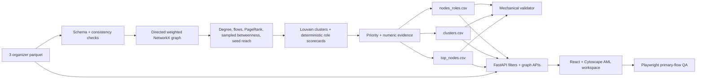

# Граф денег — explainable AML network triage

Money Graph превращает исходящую четырёхколенную транзакционную выгрузку от известных seed-клиентов в объяснимую очередь проверки для банковского AML-аналитика. Главный вопрос продукта: **кого из 2 248 GID смотреть первым и почему?**

Система не называет клиента виновным. Роль, score, кластер и аналитический сигнал — это структурная гипотеза внутри предоставленного графа и основание для углублённой проверки.

## Что реализовано

- Детерминированный parquet-to-CSV pipeline, выполняющийся примерно за **1 секунду**.
- Все обязательные артефакты: [`nodes_roles.csv`](outputs/nodes_roles.csv), [`clusters.csv`](outputs/clusters.csv), [`top_nodes.csv`](outputs/top_nodes.csv).
- Механический validator и расширенные семантические invariants.
- Read-only FastAPI для поиска, фильтрации, расследования GID/рёбер и агрегированного cluster graph.
- Russian-first AML workspace: точный поиск GID, discovery-фильтры, очередь проверки, направленный depth 0→4 graph, переходы node→flow→counterparty, percentile explainability, cluster-level view и сводная аналитика.
- Vitest-проверки display/filter helpers и 6 Playwright E2E-сценариев primary flow.
- Одна команда для запуска backend и frontend и одна команда для полного QA.

Исходные данные: **2 248 узлов · 3 119 направленных потоков · 4 840 транзакций · 365 890 012,01 KZT наблюдаемого оборота**, 2026-07-01—2026-07-31.

## Архитектура



Required outputs работают офлайн и не используют LLM, GPU, database или internet service. `OpenAIKEY` зарезервирован для optional grounded assistant и текущим приложением не читается.

## Чистая установка

Проверенная среда:

- Python 3.13;
- [uv](https://docs.astral.sh/uv/) 0.12+;
- Node.js 24 и npm 11 (должен работать Node.js 20+);
- установленный Google Chrome для локального Playwright E2E.

Из корня репозитория:

```powershell
uv sync --project backend --dev
npm ci --prefix frontend
```

Создать и проверить все обязательные CSV одной командой:

```powershell
uv run --project backend pipeline
```

Ожидаемый результат:

```text
Loaded 2248 nodes, 3119 edges, 4840 transactions
SUBMISSION VALIDATION PASSED
Pipeline completed in <5 minutes -> .../outputs
```

## Запуск backend + frontend одной командой

Убедитесь, что порты `8000` и `5173` свободны, затем выполните:

```powershell
powershell -ExecutionPolicy Bypass -File .\run.ps1
```

Открыть [http://127.0.0.1:5173](http://127.0.0.1:5173). Vite проксирует `/api` на `http://127.0.0.1:8000`.

Один `Ctrl+C` в этом терминале останавливает оба сервиса и освобождает оба порта. Vite использует `strictPort`, поэтому не переезжает незаметно на `5174`, если старый frontend остался запущен.

Отдельный запуск для debugging по-прежнему доступен:

```powershell
# terminal 1
uv run --project backend backend

# terminal 2
npm run dev --prefix frontend
```

После повторного запуска pipeline перезапустите backend: API загружает CSV в память при старте.

## Одна команда полного QA

При свободных портах `8000` и `5173`:

```powershell
powershell -ExecutionPolicy Bypass -File .\qa.ps1
```

Команда последовательно запускает:

1. pipeline;
2. output validator;
3. backend pytest;
4. Ruff;
5. frontend Vitest;
6. ESLint;
7. production build;
8. Playwright E2E с автоматическим запуском backend/frontend.

При успехе выводится `QA CHECKS PASSED`. Ошибки не скрываются.

Те же проверки по отдельности:

```powershell
uv run --project backend validate-outputs
uv run --project backend pytest -q
uv run --project backend ruff check backend/src tests
npm run test --prefix frontend
npm run lint --prefix frontend
npm run build --prefix frontend
npm run test:e2e --prefix frontend
```

## Output contracts

### `outputs/nodes_roles.csv`

Ровно 2 248 уникальных source GID. Обязательные колонки: `gid`, `role`, `role_score`, `cluster_id`, `priority_score`, `evidence`.

Дополнительные диагностические колонки содержат degree, наблюдаемые суммы/транзакции, PageRank, betweenness, seed reach, pass-through, depth, seed/truncation flags, percentile signals и score каждой роли. Это позволяет объяснить роль любого случайного GID без повторного вычисления.

### `outputs/clusters.csv`

Одна строка на Louvain community, включая isolates: `cluster_id`, `n_nodes`, `n_seed`, `sum_kzt_internal`, `top_gids`, `hypothesis`. Дополнительно: `max_priority`, `avg_priority`, `top_role`.

### `outputs/top_nodes.csv`

Top 50, отсортированные по `priority_score` descending: `rank`, `gid`, `role`, `priority_score`, `why`.

## Детерминированная аналитика

Все положительные raw metrics переводятся в percentile rank от 0 до 1; ноль остаётся нулём. Направленный граф используется для денежных потоков и ролей. Только community detection использует ненаправленную weighted projection, потому что отвечает на вопрос «какие узлы плотно связаны». Louvain и sampled betweenness используют фиксированный `seed=42`.

Betweenness использует 300 source nodes. Это воспроизводимая аппроксимация, которая сохраняет laptop-fast pipeline; значение не выдаётся за точную глобальную centrality.

### Правила ролей

Каждый specialist score ограничен `[0,1]`. Ineligible role получает ноль. Выбирается максимальный eligible score со стабильным порядком tie-breaking. Если все specialist scores ниже **0.48**, роль становится `peripheral` с выраженностью `1 - max_specialist_score`. `coordinator` дополнительно требует собственный score ≥ **0.55**.

| Role enum | Eligibility | Scorecard | Интерпретация и caveat |
|---|---|---|---|
| `consolidator` | `in_deg >= 2` | 35% incoming-degree percentile + 30% seed-reach + 20% incoming-KZT + 15% PageRank | Наблюдаемые средства сходятся из нескольких источников; не доказательство контроля. |
| `distributor` | `out_deg >= 3` | 40% outgoing-degree + 25% outgoing-KZT + 20% outgoing-tx + 15% betweenness | Наблюдаемые средства расходятся нескольким получателям. |
| `transit` | non-seed, есть вход и выход | 25% min in/out degree + 30% pass-through closeness + 20% amount balance + 15% tx balance + 10% betweenness | Наблюдаемые вход и выход похожи; seed исключены из-за неполного incoming. |
| `terminal` | `in_deg > 0`, `out_deg == 0`, **`depth < 4`** | 35% incoming-KZT + 30% incoming-degree + 20% incoming-tx + 15% seed-reach | Кандидат в сток только внутри выгрузки; depth 4 никогда не становится terminal из-за отсутствия видимого выхода. |
| `coordinator` | total degree ≥3 и score ≥0.55 | 30% betweenness + 25% PageRank + 20% seed-reach + 15% degree + 10% turnover | Структурно значимый узел, а не атрибуция организатора. |
| `peripheral` | все specialist scores <0.48 | `1 - max_specialist_score` | Выраженный специализированный паттерн не найден. |

`role_score` в UI называется «выраженность роли», а не probability/confidence of guilt.

### Priority score

Priority отдельно от роли оценивает **аналитическую ценность проверки внутри наблюдаемой сети**:

```text
structural_importance = 0.40*PageRank_pct + 0.40*betweenness_pct + 0.20*degree_pct

priority = 0.25*structural_importance
         + 0.25*max_specialist_role_score
         + 0.20*seed_reach_pct
         + 0.15*observed_turnover_pct
         + 0.15*betweenness_pct
```

Высокий priority — рекомендация внимания аналитика, не вероятность нарушения.

### Кластеры

`networkx.community.louvain_communities` работает на weighted undirected projection. Communities детерминированно сортируются по размеру и минимальному GID. Каждый isolate получает cluster ID. Hypothesis строится шаблоном по seed count, внутреннему обороту, ролям и bridge-сигналу; система не выдумывает людей или организации.

## AML workspace

Основные workflow:

- **Exact GID:** поиск → ego graph → роль/priority → percentile explanation → relationships.
- **Discovery:** drawer «Фильтры» по role, cluster, depth, priority, turnover, degree, seed reach, seed/truncation flags → список совпадений → открыть GID.
- **Relationship traversal:** строка связи открывает counterparty node; отдельная кнопка открывает flow и dated transactions; обе стороны flow кликабельны.
- **Cluster investigation:** переключатель «Узлы / Кластеры» → 91 supernode → directed inter-cluster flows → cluster summary → top GID drill-down.
- **Network analytics:** role/depth distributions, sortable cluster table, детерминированные сигналы и top inter-cluster flows.
- **Data coverage:** depth 4 визуально выделен как «граница наблюдения», а truncated GID получает явное предупреждение и не называется terminal.

GID транспортируются в browser как строки: int64-значения превышают безопасный integer JavaScript, и преобразование в `Number` повредило бы identity.

## API

| Endpoint | Назначение |
|---|---|
| `GET /api/summary` | Totals и role counts |
| `GET /api/top-nodes` | Очередь проверки |
| `GET /api/nodes?...` | Discovery filters |
| `GET /api/nodes/{gid}` | Роль, score, percentile components, evidence, coverage warning |
| `GET /api/nodes/{gid}/neighbors` | Направленные связи и cluster контрагента |
| `GET /api/edges/{src}/{dst}` | Агрегированный flow и dated transactions |
| `GET /api/clusters` / `{cluster_id}` | Cluster summaries и top nodes |
| `GET /api/graph?gid=...&cluster_id=...` | Full, ego или cluster node graph |
| `GET /api/cluster-graph` | Cluster supernodes и directed aggregated edges |
| `GET /api/analytics` | Depth counts и deterministic signal candidates |

Unknown GID, edge и cluster возвращают чистый `404`; неизвестная role-фильтрация — `422`.

## Ограничения данных и влияние на алгоритм

| Ограничение | Что делает система |
|---|---|
| Только исходящий four-hop crawl | Все суммы называются наблюдаемыми; нет заявлений о полной истории клиента. |
| Обрезание depth 4 | `truncated_by_depth`; depth-4 без видимого выхода не eligible для `terminal`; UI показывает warning. |
| Incoming seed неполон | Seed исключены из transit/pass-through role rule; evidence содержит caveat. |
| Частичный баланс графа | `in_kzt/out_kzt` не называются доходом, расходом или реальным остатком. |
| Переводы ниже 5 000 KZT отсутствуют | Нет вывода, что мелкие переводы или structuring отсутствуют. |
| Только intrabank | Нет выводов о других банках, cash, crypto или внешних rails. |
| Только июль 2026 | Score описывает месячный snapshot, а не стабильное долгосрочное поведение. |
| Нет PII/customer profile | Единственный identity key — synthetic GID; fake PII не создаётся. |
| Нет role ground truth | Используются explainable scorecards; accuracy не заявляется. |
| Heuristic scores | Role/priority — гипотезы prioritization, не guilt probability. |

## Пятиминутная демонстрация

1. Запустить `uv run --project backend pipeline`: validator PASS и runtime около секунды.
2. Запустить `powershell -ExecutionPolicy Bypass -File .\run.ps1` и открыть workspace.
3. Открыть **GID `100000003684369100`**: distributor score 0.988, priority 0.980, 24 входящих и 62 исходящих контрагента, 3.85M observed incoming, 8.59M KZT observed outgoing, 10 seed-ветвей. Открыть входящий flow 1.58M KZT от `100000008748914100`, затем перейти к отправителю.
4. Через discovery filter найти распределителей с priority ≥0.7 и открыть любой результат.
5. Найти **GID `100000003115284100`**: consolidator score 0.990, priority 0.934, 8 плательщиков, 11 seed-ветвей, 2.16M KZT observed incoming.
6. Найти depth-boundary **GID `100000000404740100`**: depth 4, 25K incoming, no visible outgoing; UI показывает границу и не называет узел terminal.
7. Переключиться в «Кластеры», выбрать supernode/edge и показать агрегированный directed flow, hypothesis и top GID.
8. Открыть «Сводная аналитика сети»: structure → clusters → signals → inter-cluster flows.
9. Попросить жюри назвать произвольный GID и повторить search → evidence → relationship traversal.

## Масштабирование примерно до 1M nodes

Product contract и scorecards сохраняются, implementation меняется:

- columnar scan через Polars/DuckDB или analytical warehouse вместо полной загрузки pandas;
- graph-tool, igraph или distributed graph engine для centrality/community detection;
- validated sampling/distributed approximations вместо текущего sampled betweenness;
- materialized node/edge/cluster aggregates и incremental recalculation;
- API pagination и server-side ego/cluster tiles;
- level-of-detail supernodes вместо передачи полного graph в browser.

Database/distributed layer здесь не добавлены: 2 248 узлов помещаются в память, а pipeline уже значительно быстрее лимита.

## Privacy и security

- `.env`, virtual environments, caches, build output, archives и `node_modules` игнорируются.
- Core analytics не отправляет organizer dataset наружу.
- API read-only и публикует только supplied synthetic GID и derived graph metrics.
- `OpenAIKEY` необязателен, остаётся в `.env` и не используется core.

## Сознательно не реализовано

- Optional AI summary и AI evals: deterministic discovery/QA имеют больший submission value; пакет `openai` не установлен.
- Light theme: low-priority cosmetic refactor после browser-verified dark demo.
- `@xyflow/react` и `recharts`: Cytoscape и CSS evidence bars уже покрывают реальные задачи без дублирующих dependencies.
- Temporal transit, cycles, resilience и anomaly model: bonus-функции не должны менять проверенный role/priority baseline.

## Карта репозитория

```text
run.ps1                                  один запуск backend + frontend
qa.ps1                                   полный deterministic + browser QA
backend/src/backend/pipeline.py          analytics + CSV export
backend/src/backend/validate_outputs.py  submission contracts
backend/src/backend/api.py               discovery, GID/flow/cluster APIs
frontend/src/App.tsx                     Russian-first AML workspace
frontend/src/domain.ts                   display/filter helpers
frontend/e2e/                            Playwright primary-flow regression
outputs/                                 обязательные generated artifacts
tests/                                   pipeline/API invariants
data_for_case/                           organizer brief, starter и parquet
```
